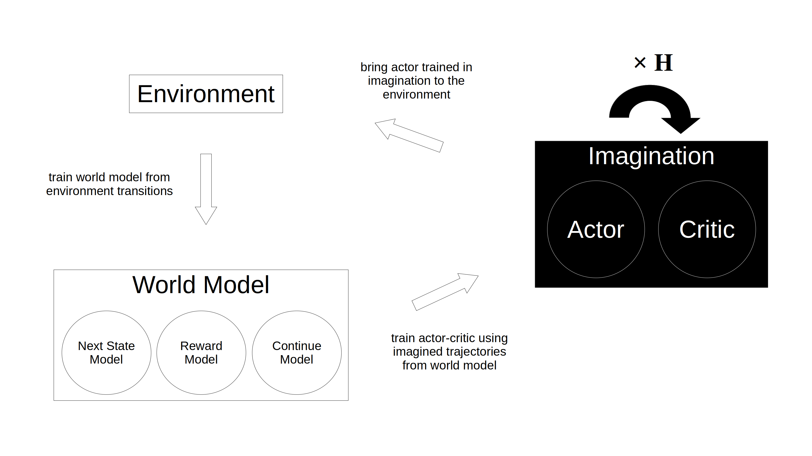
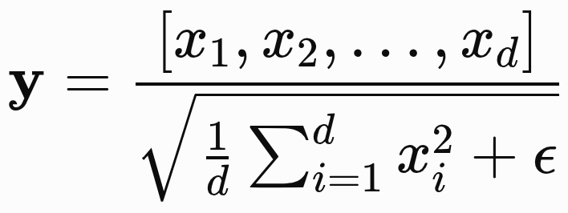
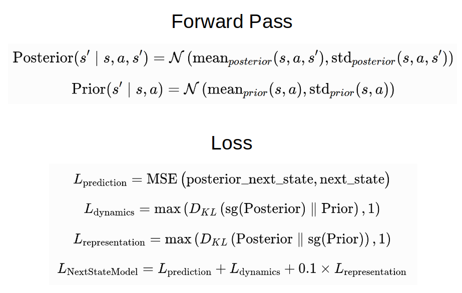
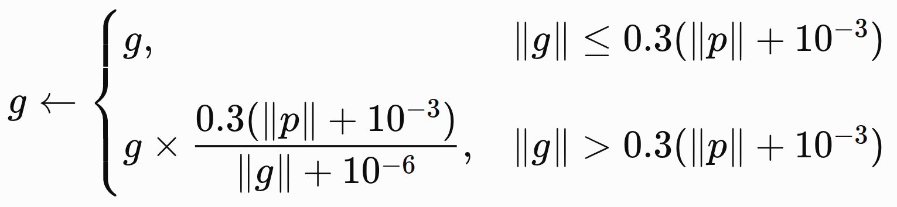

# Under-Construction
The 2018 World Model that I implemented last time failed to achieve satisfactory results due to prediction errors in world model, long training time of LSTM, inefficiency of gradient-free ES, and other practical limitations. I found Dreamer V1–V3, improved versions of the 2018 World Model, which demonstrated their ability to perform articulation control, so I decided to implement Dreamer rather than continuing with the previous one.

Although I continued trying to implement V1, it failed to achieve any meaningful performance, and I could not find out what caused the problem. So, I tried another approach that was using SAC that I had previously implemented as a starting point, and I could find out what caused the problem: RSSM (Recurrent State-Space Model). RSSM is a method that uses GRU and latent. When I used both or either one individually, reward did not increase within a short time, but increased when removing both. Reward might have increased if training had continued for several hours or days, but I did not do so because it would take too much time to run multiple experiments. While RSSM is beneficial for image inputs because they consist of high-dimensional pixel values, it is not essential for state vector inputs, and the model can learn faster without it, which led me to remove it.

Unlike the 2018 World Model, Dreamer repeatedly updates world model and actor-critic in sequence, allowing world model to learn from new experiences and reduce prediction error. However, simply doing this still left some prediction errors, causing reward to decrease over time and leading to a complete collapse. I was able to significantly reduce world model loss and improve actor-critic by applying various techniques described in V1–V3, but I only applied the techniques that worked well or that I considered necessary.

## Diagram

Here are some of the techniques applied in this implementation. There are other techniques as well, but they are not mentioned here for brevity.

### RMSNorm

RMSNorm is a normalization that applies square-mean-root to the input, and then divides the input by this value to make the input's scale around 1. This helps prevent gradient explosion and vanishing when the input becomes extremely large or small. Although it may slow down learning convergence when the gradient is reasonably large, it can help achieve better final performance. The original RMSNorm has learnable parameters that allow the normalized values to be adjusted, but I did not include them because they slowed down learning convergence in the early stages of training.

### Next State Model (Posterior/Prior, Mean/Std)

The basic approach to predicting next state is to make the prediction without seeing actual next state, like Prior. However, adding Posterior that sees actual next state and training Prior/Posterior distributions can improve prediction accuracy because Posterior takes the answer as input. In dynamics loss, stop gradient to Posterior so that Prior learns Posterior's next state distribution. In representation loss, stop gradient to Prior so that Posterior learns prior's representation to help Prior predict better, and multiply this loss by 0.1 to prevent weakening Posterior's performance. Also, apply max 1 to both losses to make their gradients 0 when they are below 1, preventing bad shortcuts such as increasing Std to make the distributions too similar. Lastly, use MSE to make Posterior match the actual next state, so that both distributions can be learned correctly. Additionally, Mean/Std approach enables expressing uncertainty and representing multiple possible predictions, which can improve prediction accuracy as well.

### Adaptive Gradient Clipping

Before updating parameters, gradient clipping is often used to prevent gradient explosion by limiting the magnitude of gradients. I have used a gradient clipping method that limits the gradient magnitude to 1 for all parameters so far. But here, the adaptive method is used to limit the gradient magnitude relative to the size of each parameter. If the gradient magnitude exceeds 30% of the parameter magnitude, the gradient is reduced to 30% of the parameter magnitude. 1e-3 is added to the parameter magnitude so that gradients are not clipped to become too small when the parameter magnitude is already small. The reason for comparing the gradient with the parameter is that gradient can be relatively large or small depending on the size of the parameter. So, this adaptive method can better handle increases in gradient magnitude than the fixed-threshold method.

### Adam vs <ins>LaProp</ins>
Before going into detail, Adam stands for Adaptive Moment Estimation, and LaProp, I could not find what exactly it stands for, seems to stand for Learning rate Adaptive Propagation. Both use momentum to adjust learning rate for each parameter, so the names do not really distinguish between them. The main difference lies in the order of computing GM and GSM.

Looking at Adam first, GM adjusts the update direction, while GSM adjusts the update magnitude, and both use momentum that gives more weight to previous values to avoid being overly affected by sudden changes in the gradient. And then, since both GM and GSM are initially 0, correction is applied to prevent them from becoming too small at the beginning. Finally, The learning rate is multiplied by GM and divided by the square root of GSM.

For LaProp, however, GSM is first calculated to obtain the normalized gradient, and then this normalized gradient is used to calculate GM. The reason for using the normalized gradient is to reduce the effect of the gradient's magnitude when calculating GM, allowing GM to focus more on its direction. This helps world models, where accuracy is important, converge smoothly by reducing sudden changes in updates, although it may lose some useful gradient magnitude information.

### return spread
### actor loss
